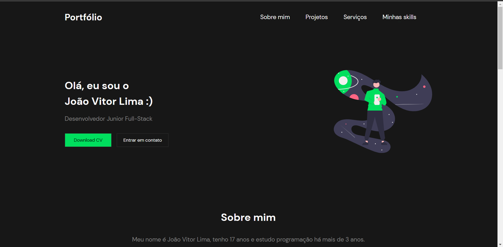

# Portfólio responsivo feito em React

## Acesse o deploy do portfólio: [Portfólio](https://portifolio-cyhwaz2vc-jvolima.vercel.app/)

## Tecnologias utilizadas
- React
- Typescript
- Styled-components

## Habilidades desenvolvidas
- Responsividade 
- Compartilhamento de funções por propriedades
- Tipagem de componentes
- React-modal

## Versão desktop

## Versão mobile

